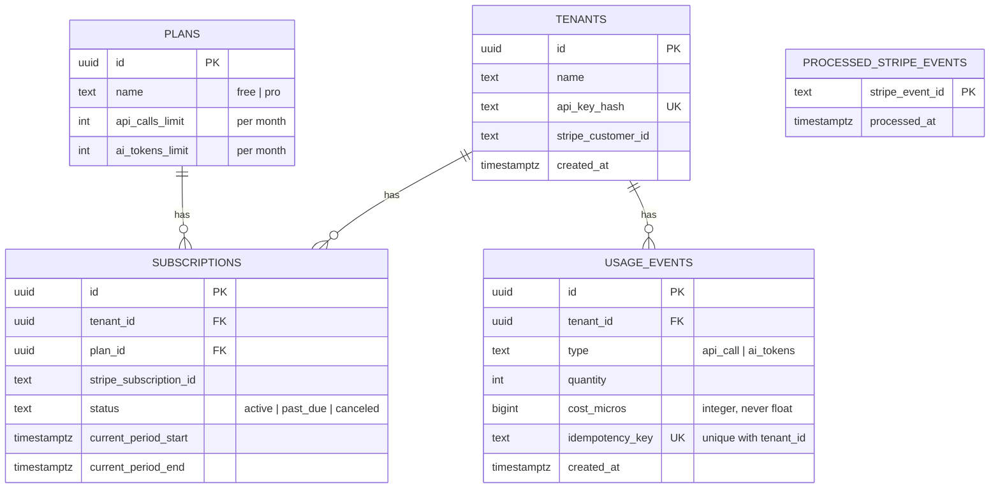

# Design Doc: Usage Metering & Billing Engine

## Problem

Answer three questions for every tenant: how much have they used, what does it
cost, and have they hit their limit. All of this has to stay correct under
retries, duplicate webhooks, and quota boundaries.

## Stack

Node.js + Express + TypeScript, Prisma + PostgreSQL (Docker), Stripe test
mode + Stripe CLI, Vitest + Supertest. pnpm for package management.

## Data model

Every table carries `tenant_id` (directly or via FK), so no query can leak
across tenants by construction. Money is always an integer (`cost_micros`),
never a float.

## Plans & quotas

| Plan | API calls / mo | AI tokens / mo |
| ---- | -------------- | -------------- |
| Free | 1,000          | 100,000        |
| Pro  | 50,000         | 5,000,000      |

Pricing constants (per-unit cost, cached-input discount, reasoning-tokens-as-
output rule) live in a config module, not DB rows, and are covered by tests.

## API surface

- `POST /generate`: the one dummy billable endpoint.
  Requires `Authorization: Bearer <tenant_api_key>` and `Idempotency-Key`.
  Flow: resolve tenant, check idempotency key, check quota, record
  `usage_event`, compute cost, respond.
- `GET /usage`: rollup for the current period, `{ used, limit, cost }` per
  usage type.
- `POST /billing/checkout`: creates a Stripe Checkout session for a Free to
  Pro upgrade.
- `POST /webhooks/stripe`: signature-verified, deduplicated handler for
  `checkout.session.completed`, `customer.subscription.updated`,
  `customer.subscription.deleted`.

Status codes: `429` quota exceeded (explanatory message), `402` invalid or
lapsed subscription, `400` forged webhook signature.

## Idempotency strategy

- Client sends `Idempotency-Key` on every billable request.
- `unique (tenant_id, idempotency_key)` on `usage_events` is the enforcement
  mechanism, not application-level checks alone.
- On a duplicate key: no new row is written; the original event's result is
  looked up and returned unchanged.
- Webhooks use the same pattern against `processed_stripe_events
(stripe_event_id)`, since Stripe's event ID is the natural idempotency key
  there.

## Auth

Tenant-level only: a per-tenant API key resolved server-side to `tenant_id`.
No per-user login, sessions, or roles.
